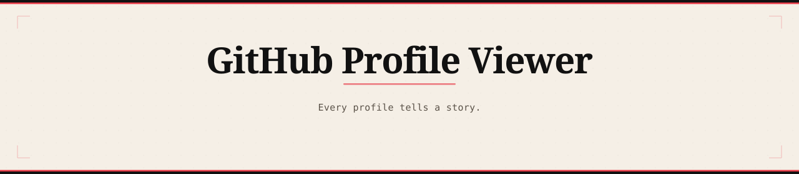

  

  <a href="https://bytiagodev.github.io/github-profile-viewer/">Live</a> · <a href="https://bytiago.com">Portfolio</a>

---

# GitHub Profile Viewer

A frontend project built with vanilla HTML, CSS and JavaScript, using the public GitHub REST API. No frameworks, no build tools, no dependencies. Just the browser.

## The idea

This started as a profile search tool and turned into something with a point of view. The brief was simple: search a GitHub username, see their profile. But from the beginning I wanted to build something that felt designed, not assembled from tutorial scraps.

The result is an app that treats every developer's profile as something worth presenting well. A warm palette, a considered type system, a visual language that connects the data end to end. It is built around one idea: every profile tells a story.

## What it does

Search any GitHub username and get a full profile view. The card shows name, handle, bio, stats and links. The avatar ring changes color to match the user's most used language, so the card's visual identity is tied to the data underneath it.

Below the card, a language breakdown shows the top languages across all public repos with animated proportional bars. Repositories toggle between most starred and most recently updated, with a count of how many are displayed out of the total.

The hero collapses after the first search. A flow at the bottom of the results lets you keep exploring without scrolling back up, and there is a way to return to the beginning if you want to start over.

Errors are handled gracefully. A loading state covers slow connections. Suggestion buttons help first-time visitors know where to start.

## What makes it different

The design has a point of view. Warm camel background, Fraunces display type in the hero, DM Mono as the system font, a restrained red accent, and dark bookend header and footer. Nothing in here is default.

The repo cards use the same language color system as the chart, so the data reads as one connected surface rather than separate sections. Profile and repo names share the same accent color. The avatar ring picks up the user's top language color. These decisions are small but they compound: the whole interface feels like it knows what it is.

There are things in here for people who look closely. Developers who read source code will find something. Anyone curious enough to search a specific username will find something too.

## Design details

| Element | Choice |
|---|---|
| Background | `#f5efe6` warm camel |
| Accent | `#e63946` restrained red |
| Display type | Fraunces 700 |
| Body type | DM Mono 400 |
| Dark bookends | `#111111` header and footer |
| Cards | `#fdf9f5` on `#ddd5c8` borders |
| Avatar ring | Dynamic, matches top language color |
| Language bars | Animated fill on render, color per language |
| Repo cards | Hover lift, accent border on hover |

## Live

**[bytiagodev.github.io/github-profile-viewer](https://bytiagodev.github.io/github-profile-viewer)**

---

  Made by <a href="https://github.com/bytiagodev">Tiago Teixeira</a> · <a href="https://bytiago.com">bytiago.com</a>

